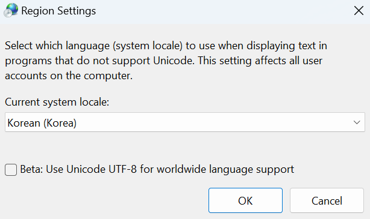
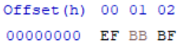

한글 visual studio로 파일을 만들면 cp949로 인코딩이 된다. 이게 깃허브나 visual studio code 같은 곳에서 읽어 들일 때, 한글 주석들이 깨져 보인다.

그래서 visual studio에서 utf-8으로 인코딩하는 방법을 찾아봤는데, 두 가지 정도 방법이 있다.
​
## .editorconfig 파일 생성

.editorconfig를 만들어서 utf-8으로 설정하면 된다고 한다.

```
[*]
charset = utf-8
```

근데 이미 cp949로 인코딩 된 수십개의 파일은 바꿀 수 없다... 찾아보니 이런 좋은게 있었다.

[파일 인코딩 일괄 변경 프로그램. : 네이버 블로그 (naver.com)](https://blog.naver.com/goofygod/110024510522)

이분 덕분에 안도의 한숨을... 2007년도 글인데 다들 고맙다고 2023년까지 댓글이 달린다 ㅋㅋㅋㅋㅋ 내가 만들어야 하나 고민했는데 다행히 이미 있다..

## system locale 설정

이 방법은 윈도우 10부터 가능한건데 아래 사진에서 Beta: Use Unicode.... 이걸 체크하면 된다.



이거 설정하면 VS에서 파일 생성 시, utf-8으로 바뀌게 된다.

근데 이건 큰 문제가 있다.
​
무슨 문제냐면, 이거 설정하고 다른 컴퓨터에서 컴파일하면 인코딩 문제로 경고가 엄청나게 뜬다. 원인은 utf-8 without bom으로 만들어지기 때문이다.

## utf-8 without bom vs utf-8 with bom

BOM은 Byte Order Mark라는데 문서 맨 앞에 바이트 순서를 매직 넘버로 써넣는 것이다.

utf-8은 아래 사진 처럼 0xEF 0xBB 0x BF가 추가 된다.



without bom으로 저장되면 영문판에선 잘 작동하는데, 한글판에선 경고를 준다. 그래서 with bom으로 바꿔줘야 한다.

## .editorconfig vs system locale 설정

후자도 결국 with bom으로 저장하려면 .editorconfig를 통해 다음과 같이 설정해야 한다.

```
[*]
charset = utf-8-bom
```

그러니까 그냥 .editorconfig에 바로 위 설정을 넣어주도록 하자.

**하지만 여기서 매크로 어셈블러로 어셈블리 작성 시 문제가 발생한다.**

## Visual Studio에서 x64 어셈블리 프로그래밍 시 문제점

Visual Studio에서 x64 어셈블리 프로그래밍을 하려면 .asm 파일을 만들고, 매크로 어셈블러로 어셈블해서 나온걸 링크 해줘야 한다.

ml64로 어셈블할 때, utf-8 with bom으로 되어 있으면 인코딩 문제로 어셈블되지 않는다....

​

그래서 최종적인 .editorconfig는 다음과 같다.

```
[*]
charset = utf-8-bom

[*.asm]
charset = utf-8
```

이러면 어셈 파일만 따로 utf-8 without bom 형태로 저장된다.