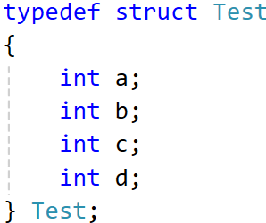
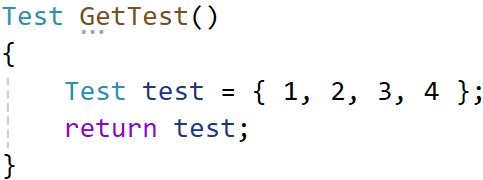
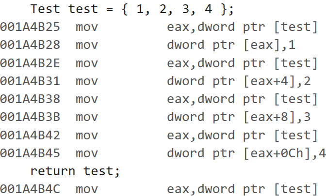
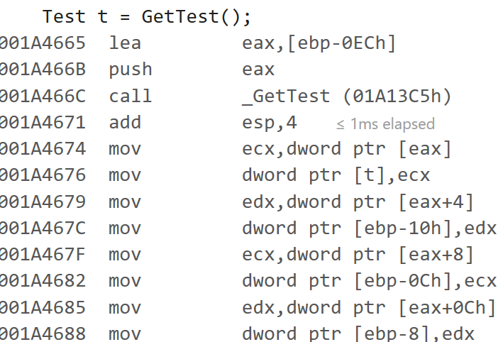

먼저, x86의 모든 호출 규약은 eax, ecx, edx, esp를 제외한 모든 레지스터는 보존해야 한다.

|32비트 이하|64비트 이하|64비트 초과|
|---|---|---|
|eax|edx:eax|eax(스택 주소)|

함수에서 반환값은 위 표처럼 기본적으로 eax 레지스터에 저장된다. 64비트 이하의 경우 상위 32비트는 edx에, 하위 32비트는 eax에 저장된다.

64비트를 초과하면 eax에 스택 주소를 저장하고 반환한다. 반환 이후에 저장된 스택 주소로부터 값을 하나씩 복사한다.

이런 구조체와 함수로 테스트를 진행해봤다.

마지막 반환 코드를 보면 test의 주소를 eax에 넣는다.

반환 이후엔 저장된 주소로부터 값을 하나씩 복사하는 것이 보인다.

=> **64비트가 넘어가면 그냥 out 매개변수 하나 받아서 거기로 반환하는게 좋을듯**

  

|호출 규약|스택 정리|매개변수전달 순서|
|:---:|:---:|:---:|
|__cdecl|호출자|오른쪽 -> 왼쪽|
|__stdcall|피호줄자|오른쪽 -> 왼쪽|

C++의 경우 this 포인터가 ecx에 저장된다.

---

일단 이정도만 알면 될 것 같다. 다음엔 __vectorcall 정리할건데, 좀 헷갈리는게 많아 보인다.