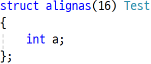
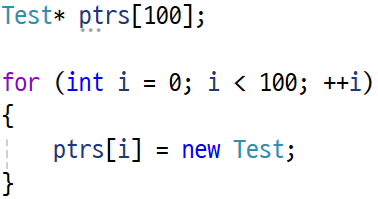
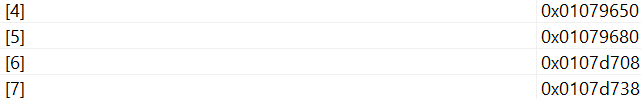
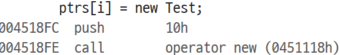
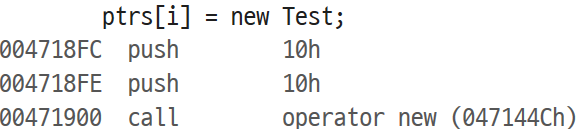

SIMD 프로그래밍을 하려면 메모리가 정렬되어 있어야 한다. 예를 들면 __m128은 16바이트 정렬, __m256은 32바이트 정렬이 되어 있어야 한다.

alignas()나 __declspec(align())을 사용해서 정렬을 해두면 스택 메모리에서 할당할 땐 아무런 문제가 없다. 문제는 힙 할당을 하면 정렬되지 않는다.

64비트에서 malloc/new로 힙 할당하면 16바이트 정렬, 32비트에서의 동적할당은 8바이트 정렬이기 때문에 정렬 문제가 발생하게 된다. 그래서 _aligned_malloc을 사용해서 힙 할당을 해야 한다.

32비트에서 실행하면 구조체 자체는 16바이트 정렬이지만 힙 할당을 하면 8바이트 정렬인 것을 알 수 있다.

그래서 new를 오버로딩해서 _aligned_malloc을 호출하도록 하려고 했는데, C++ 17에 aligned new라는게 들어왔다.

C++ 17 이전 코드는 단지 16바이트만큼 할당해주는게 끝인데, 17부턴 정렬 크기까지 전달해준다. 내부적으론 _aligned_malloc을 호출 시켜준다.

그래서 해결 방법은 두 가지로 보인다.

1. 수동으로 new 오버로딩해서 _aligned_malloc을 호출

1. C++ 17로 버전업