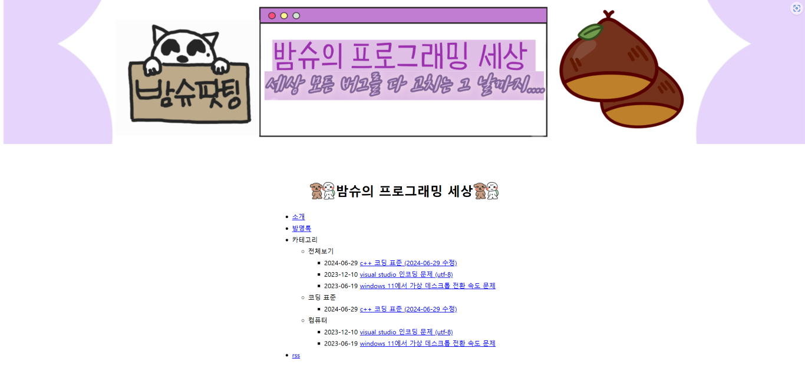

## 네이버 블로그
내가 학습한거나 개발 일지를 작성하려고 블로그를 시작했다. 그리고 혹시라도 누군가에게 도움이 될 수도 있다 생각하기도 했다.

하지만 주로 개발 관련 글을 올리는 나에겐 네이버 블로그는 적절치 않았다.

1. 소스 코드 가독성이 매우매우 좋지 않다.
써 본 사람은 알겠지만 정말 가독성이 안 좋다.

1. 개발을 하려는 사람은 어차피 네이버로 검색하지 않는다.

그래서 어떤 블로그로 옮길까 생각하다가..

## GitHub Page + Jekyll
다른 블로그들은 이런저런 단점들이 있어서 결국 귀찮지만 자유도가 높은 GitHub Page + Jekyll로 이동하게 됐다.

[no style, please](http://jekyllthemes.org/themes/no-style-please/) 이 템플릿이 마음에 들어서 이걸 기반으로 커스텀했다.
그리고 [giscus](https://giscus.app/ko)로 댓글까지 추가했다.

아마 디자인은 이정도까지 하고, 나중에 여러가지 해보고 싶은 것들을 추가할 것 같다.

마크다운으로 블로그 글을 작성하는건 귀찮지만 소스 코드 가독성 만큼은 최상이다.

---

혹시라도 GitHub Page로 블로그 만들기가 궁금한 사람이 있다면 포스팅하겠습니다.