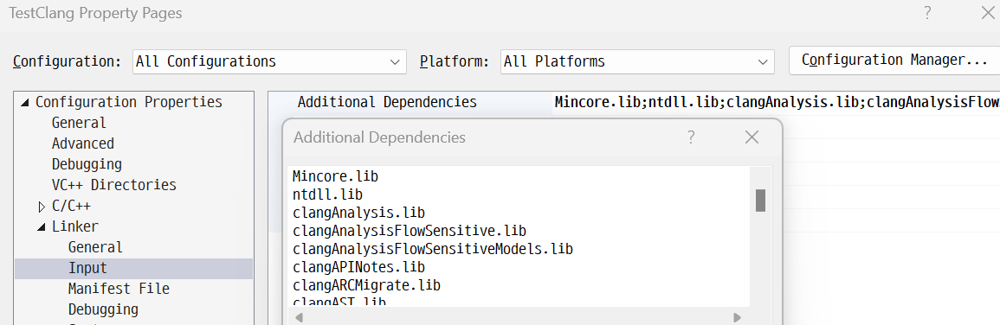

## 문제점
[https://github.com/llvm/llvm-project/releases/tag/llvmorg-18.1.8](https://github.com/llvm/llvm-project/releases/tag/llvmorg-18.1.8) 해당 사이트에서 인스톨러로 설치하면 Clang 라이브러리 헤더 파일이 없어서 Clang 라이브러리를 사용할 수가 없다.

그래서 직접 LLVM을 빌드하여 Visual Studio로 Clang 라이브러리 사용하는 방법을 소개한다.

## 환경
- Windows 11 Home 23H2 (Build 22631.3737)

- Visual Studio 2022 Version 17.10.3

- LLVM 18.1.8

- CMake 3.30.0

- Python 3.12.4

- C++ 17이상

## 프로그램 설치

### LLVM 18.1.8
[https://github.com/llvm/llvm-project/releases/tag/llvmorg-18.1.8](https://github.com/llvm/llvm-project/releases/tag/llvmorg-18.1.8) 여기서 인스톨러를 다운로드 받아 설치한다.

### Python
아마 파이썬 3.8 이상부터 가능할 것이다.

[https://www.python.org/downloads/](https://www.python.org/downloads/)

### CMake
몇 버전부터 가능한진 모르겠는데 그냥 현재 기준 최신 버전(3.30.0)으로 설치했다.

[https://cmake.org/download/](https://cmake.org/download/)

### Visual Studio Installer
아래처럼 Visual Studio Installer에서 LLVM 툴셋만 체크해서 설치한다.


## LLVM 빌드
### 참조
[https://stackoverflow.com/questions/33255579/how-can-i-use-libtooling-clang-in-visual-studio](https://stackoverflow.com/questions/33255579/how-can-i-use-libtooling-clang-in-visual-studio) 여기 따라하면 된다.

### 빌드 과정
1. [https://github.com/llvm/llvm-project/releases/tag/llvmorg-18.1.8](https://github.com/llvm/llvm-project/releases/tag/llvmorg-18.1.8) 여기에서 가장 아래 있는 Source code zip 파일을 다운 받아서 압축 푼다.

1. 압축 푼 LLVM 폴더에 CMake결과를 저장할 폴더를 생성한다.

    난 아래 처럼 'build-x64'로 만들었다. 그러므로 앞으론 'build-x64' 기준으로 설명한다.
    

1. PowerShell에서 ‘build-x64’경로로 이동 후 다음 명령어 입력
    ```
    cmake -DLLVM_TARGETS_TO_BUILD="X86" -DLLVM_ENABLE_PROJECTS=clang -G "Visual Studio 17 2022" -A x64 -Thost=x64 ..\llvm -DCMAKE_C_FLAGS="/utf-8" -DCMAKE_CXX_FLAGS="/utf-8"
    ```

    참고로 x86/x86_64 플랫폼만 빌드한다. 다른 플랫폼이라면 -DLLVM_TARGETS_TO_BUILD 플래그 찾아보면 된다.

    

    시간이 약간 걸린다.

1. LLVM.sln을 열어 Clang을 빌드한다.
    
    빌드 과정은 꽤 오래 걸린다.

    

    

## Visual Studio에서 Clang library를 사용하기 위한 프로젝트 세팅
### 프로젝트 속성
1. General
    - Platform Toolset: LLVM (clang-cl)
    - C++ Language Standard: C++ 17 이상

    

1. Advanced
    - LLVM Toolset Version: 18.1.8

1. C/C++ -> General
    - Additional Include Directories
        - [LLVM 경로]/clang/include
        - [LLVM 경로]/llvm/include
        - [LLVM 경로]/build-x64/include
        - [LLVM 경로]/build-x64/tools/clang/include

    

1. Linker
    - General
        - Additional Library Directories
            - [LLVM 경로]/build-x64/Debug/lib
    
    - Input
        - Additional Dependencies
            - Clang 관련 모든 라이브러리 추가 (어떤 라이브러리가 필요한지 명확하지 않으므로)
                - [부록](#부록)을 참조하면 쉽게 가능하다.
            - Mincore.lib 추가 - **추가하지 않으면 오류 발생**
            - ntdll.lib 추가 - **추가하지 않으면 아래와 같은 오류 발생**
                ```
                undefined symbol: __declspec(dllimport) RtlGetLastNtStatus
                ```
            - Inherit from parent or project defaults 체크

    

    

1. Directory.build.props 설정

    솔루션 파일(.sln)이 있는 디렉토리(루트 디렉토리)에 **Directory.build.props**을 생성하고 그 내용을 다음과 같이 채워준다.

    ```
    <Project>
        <PropertyGroup>
            <LLVMInstallDir>C:\Program Files\LLVM</LLVMInstallDir>
            <LLVMToolsVersion>18.1.8</LLVMToolsVersion>
        </PropertyGroup>
    </Project>
    ```

### 테스트 프로그램 실행


## 부록
### 디렉토리 내 모든 lib 파일명 출력
디렉토리 내 모든 lib 파일명 출력하는 파이썬 스크립트다.

**directory_path**에 경로 삽입

```py
import os

def list_lib_files(directory):
    # .lib 파일명을 저장할 리스트 생성
    lib_files = []

    # 디렉토리 내의 파일 목록을 조회
    for filename in os.listdir(directory):
        # .lib 확장자를 가진 파일만 추가
        if filename.endswith('.lib'):
            lib_files.append(filename)

    # 파일명을 ";"로 구분하여 출력
    print(";".join(lib_files))

# 사용할 디렉토리 경로를 지정
directory_path = 'D:\\llvm-project-llvmorg-18.1.8\\build-x64\\Debug\\lib'

# 함수 호출
list_lib_files(directory_path)
```

출력 결과로 나온 파일명들을 그대로 복사/붙여넣기 하면 된다.