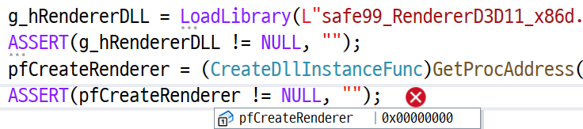
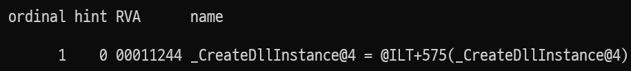

## 문제




```c
GetProcAddress();
```

해당 함수 호출 시, x64에선 잘 됐는데, x86에선 NULL을 반환하는 현상 발견

내가 작성한 함수들은 다 __stdcall인데, 혹시나 해서 __cdecl로 했더니 잘 된다.
**dumpbin**으로 확인해보니 함수 이름이 바뀌어있다.



## 해결 방법

.def 파일 쓰면 된다.

---

그래도 빨리 찾아서 시간 아꼈다..